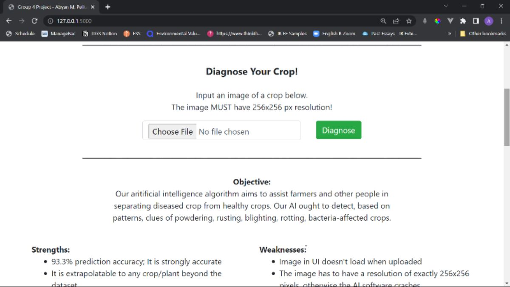

### [ABANDONED] group4project
This is the source code for a convolutional neural network (CNN) model i made using PyTorch for my highschool IB group 4 project in March 2023. The model was created for the purpose of detecting crop disease given a 256x256px image input.

